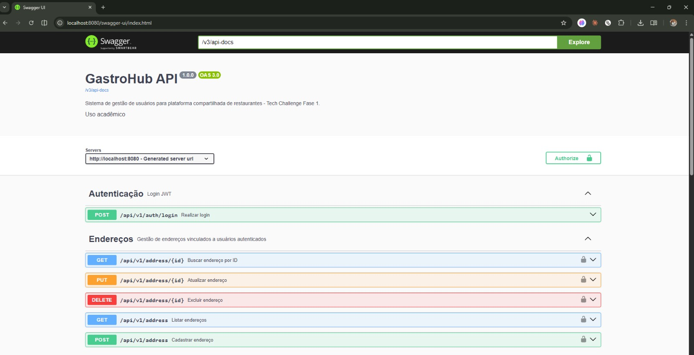
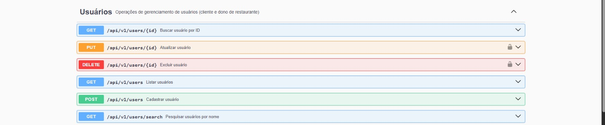
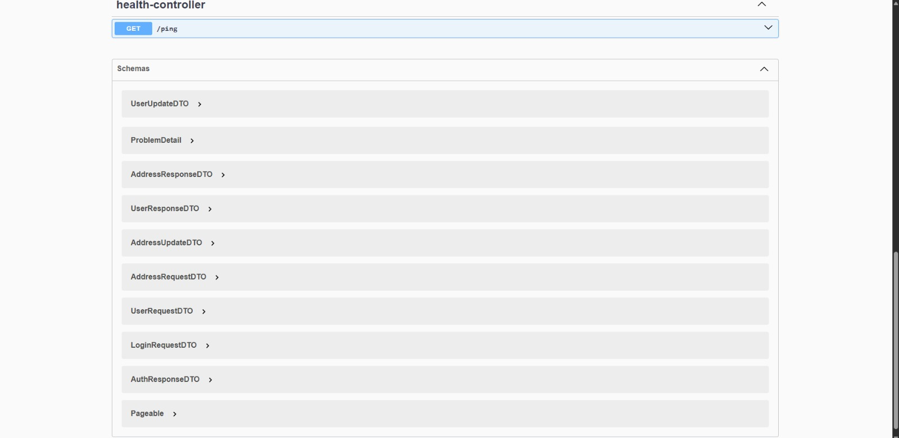
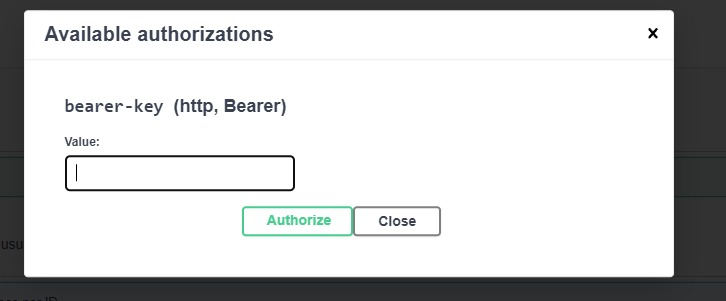

# GastroHub

Backend Spring Boot para o Tech Challenge Fase 1 da FIAP em Arquitetura e Desenvolvimento Java.
O projeto implementa uma API REST para gerenciamento de usuarios, enderecos e autenticacao em uma plataforma compartilhada de restaurantes.

<p align="left">
  
  
  
  
  
  
  
  
  
  
  
  
  
</p>

## Funcionalidades

- Cadastro de usuarios com perfil de cliente ou dono de restaurante.
- Autenticacao stateless com JWT e senhas criptografadas com BCrypt.
- Consulta paginada, busca por nome, atualizacao e remocao de usuarios.
- Troca de senha por endpoint dedicado em `/api/v1/auth/password/{userID}`.
- Cadastro, listagem, consulta, atualizacao e remocao de enderecos vinculados ao usuario autenticado.
- Validacoes de e-mail e login unicos por Strategy Pattern.
- Respostas de erro padronizadas com `ProblemDetail` no formato RFC 7807.
- Migrations de banco com Flyway para criacao e evolucao do schema MySQL.
- Documentacao interativa com Swagger/OpenAPI e exemplos de sucesso e erro.
- Envio de notificacao por e-mail apos cadastro de usuario.
- Collection Postman versionada em `docs/postman/GastroHub API.postman_collection.json`.

## Tecnologias

| Tecnologia | Versao | Uso no projeto |
| --- | --- | --- |
| Java | 21 | Linguagem base da aplicacao |
| Spring Boot | 3.2.12 | Inicializacao, injecao de dependencias e configuracao da API |
| Spring Web | 6.x | Controllers REST e serializacao JSON |
| Spring Data JPA | 3.x | Persistencia com repositories e entidades JPA |
| Spring Security | 6.x | Autenticacao stateless e autorizacao por roles |
| MySQL | 8.0 | Banco de dados principal em execucao local/Docker |
| Flyway | Boot managed | Evolucao de schema por migrations |
| MapStruct | 1.5.5.Final | Mapeamento entre entidades e DTOs |
| Lombok | 1.18.38 | Reducao de boilerplate em classes do projeto |
| SpringDoc OpenAPI | 2.3.0 | Swagger UI e contrato OpenAPI |
| JJWT | 0.12.x | Geracao e validacao de tokens JWT |
| JUnit 5 + Mockito | Boot managed | Testes unitarios e de integracao |
| H2 | Test scope | Banco em memoria para testes de integracao |
| Docker Compose | 3.9 | Orquestracao local da API e MySQL |

## Arquitetura

O codigo esta organizado por dominio em `user`, `address`, `notification` e `health`, com configuracoes transversais em `config` e infraestrutura em `infra`.
Os casos de uso de usuario e endereco seguem uma abordagem CQRS-lite, separando interfaces de comando (`CommandService`) e consulta (`QueryService`) para deixar leitura e escrita mais explicitas.

As validacoes de unicidade ficam isoladas em strategies, o mapeamento entre entidades e DTOs usa MapStruct, e as excecoes de negocio sao centralizadas no `GlobalExceptionHandler`, que monta respostas `ProblemDetail` por meio do `ProblemDetailFactory`.
A seguranca usa Spring Security com JWT stateless, filtro customizado de autenticacao e roles `ROLE_CLIENTE` e `ROLE_DONO_RESTAURANTE`.
O modulo `notification` escuta eventos de usuario criado e envia e-mail de boas-vindas usando Spring Mail.

```text
br.com.gastrohub/
|-- address/
|   |-- controller/       # Endpoints REST de endereco e interfaces docs do Swagger
|   |-- dto/              # Records de entrada e saida da API de endereco
|   |-- entity/           # Entidade JPA Address
|   |-- mapper/           # Conversao Address <-> DTO com MapStruct
|   |-- repository/       # Acesso ao banco via Spring Data JPA
|   `-- service/          # Regras e consultas de endereco
|-- config/               # Configuracoes transversais, incluindo OpenAPI
|-- health/
|   `-- contoller/        # Health check /ping
|-- infra/
|   |-- exception/        # Excecoes, handlers globais e ProblemDetail
|   `-- security/         # Spring Security, JWT provider e filtro JWT
|-- notification/
|   |-- listener/         # Listener do evento de usuario criado
|   `-- service/          # Envio de e-mail
`-- user/
    |-- controller/       # Endpoints REST de usuarios/autenticacao e docs Swagger
    |-- dto/              # Records de request/response
    |-- entity/           # Entidade User e enum Role
    |-- event/            # Eventos de dominio da camada de usuario
    |-- mapper/           # Conversao User <-> DTO com MapStruct
    |-- repository/       # Consultas de usuario no banco
    |-- service/          # Casos de uso de usuario e autenticacao
    `-- strategy/         # Validadores de login/e-mail unico
```

## Endpoints

| Metodo | Path | Descricao | Auth |
| --- | --- | --- | --- |
| GET | `/ping` | Health check da API | Publico |
| GET | `/v3/api-docs` | Contrato OpenAPI em JSON | Publico |
| GET | `/swagger-ui.html` | Interface Swagger UI | Publico |
| POST | `/api/v1/users` | Cria um usuario | Publico |
| GET | `/api/v1/users` | Lista usuarios com paginacao | Publico |
| GET | `/api/v1/users/{id}` | Busca usuario por ID | Publico |
| GET | `/api/v1/users/search?nome={nome}` | Busca usuarios por nome | Publico |
| PUT | `/api/v1/users/{id}` | Atualiza dados do usuario | Bearer JWT (`ROLE_CLIENTE` ou `ROLE_DONO_RESTAURANTE`) |
| DELETE | `/api/v1/users/{id}` | Remove usuario | Bearer JWT (`ROLE_DONO_RESTAURANTE`) |
| POST | `/api/v1/auth/login` | Autentica usuario e retorna token JWT | Publico |
| PATCH | `/api/v1/auth/password/{userID}` | Troca a senha do usuario informado | Publico na configuracao atual |
| POST | `/api/v1/address` | Cria endereco para o usuario autenticado | Bearer JWT |
| GET | `/api/v1/address` | Lista enderecos | Bearer JWT |
| GET | `/api/v1/address/{id}` | Busca endereco por ID | Bearer JWT |
| PUT | `/api/v1/address/{id}` | Atualiza endereco | Bearer JWT |
| DELETE | `/api/v1/address/{id}` | Remove endereco | Bearer JWT |

### Exemplos de requisicao

Criar usuario:

```bash
curl -X POST http://localhost:8080/api/v1/users \
  -H "Content-Type: application/json" \
  -d '{
    "nome": "Cliente Teste",
    "email": "cliente@email.com",
    "login": "cliente01",
    "senha": "123456",
    "role": "ROLE_CLIENTE",
    "address": [
      {
        "cep": "01001-000",
        "rua": "Praca da Se",
        "numero": "100",
        "cidade": "Sao Paulo",
        "estado": "SP"
      }
    ]
  }'
```

Login:

```bash
curl -X POST http://localhost:8080/api/v1/auth/login \
  -H "Content-Type: application/json" \
  -d '{
    "login": "cliente01",
    "senha": "123456"
  }'
```

Trocar senha:

```bash
curl -X PATCH http://localhost:8080/api/v1/auth/password/7f9f0f1e-7a6f-4a45-8d2e-9f9f6f3b8a11 \
  -H "Content-Type: application/json" \
  -d '{
    "password": "novaSenha123"
  }'
```

Criar endereco autenticado:

```bash
curl -X POST http://localhost:8080/api/v1/address \
  -H "Content-Type: application/json" \
  -H "Authorization: Bearer <token>" \
  -d '{
    "cep": "01311-000",
    "rua": "Avenida Paulista",
    "numero": "1000",
    "cidade": "Sao Paulo",
    "estado": "SP"
  }'
```

## Como Rodar Com Docker Compose

1. Clone o repositorio:

```bash
git clone https://github.com/Joaomacosdev/gastrohub.git
cd gastrohub
```

2. Crie um arquivo `.env` na raiz do projeto:

```env
DB_ROOT_PASSWORD=root
DB_NAME=gastro_hub_db
DB_USER=gastro
DB_PASSWORD=G@str00
DB_PORT=3306
MAIL_USER=seu-email@gmail.com
MAIL_PASSWORD=sua-senha-de-app
JWT_SECRET=sua-chave-secreta-com-tamanho-seguro
JWT_EXPIRATION=86400000
```

3. Suba a aplicacao e o MySQL:

```bash
docker compose up --build
```

4. Acesse:

- API: `http://localhost:8080`
- Swagger UI: `http://localhost:8080/swagger-ui.html`
- OpenAPI JSON: `http://localhost:8080/v3/api-docs`

## Como Rodar Localmente Sem Docker

Para rodar a aplicacao localmente, suba apenas o MySQL pelo Compose:

```bash
docker compose up mysql -d
```

Depois execute a aplicacao com o Maven Wrapper:

```bash
./mvnw spring-boot:run
```

No Windows, se preferir:

```bash
.\mvnw.cmd spring-boot:run
```

A configuracao local usa MySQL em `localhost:3309`, banco `gastro_hub_db`, usuario `gastro` e senha `G@str00`, conforme `application.properties`.

## Testes

Execute toda a suite:

```bash
./mvnw test
```

Execute um teste especifico:

```bash
./mvnw test -Dtest=UserServiceImplTest
```

O projeto possui testes unitarios com JUnit 5 e Mockito para services e validators de usuario, somando 23 cenarios unitarios nesta entrega.
Tambem ha testes de integracao com `@SpringBootTest`, MockMvc e H2 cobrindo fluxos E2E da API.

Resultado validado nesta branch:

```text
Tests run: 29, Failures: 0, Errors: 0, Skipped: 0
BUILD SUCCESS
```

Observacao: a entrega alvo e Java 21. Em ambiente local com JDK 25, pode ser necessario rodar os testes com `-DargLine="-Dnet.bytebuddy.experimental=true"` por compatibilidade do Mockito/Byte Buddy.

## Documentacao Da API

A documentacao Swagger esta disponivel em:

```text
http://localhost:8080/swagger-ui.html
```

Ela inclui exemplos de request/response de sucesso e erro para os principais endpoints, usando o formato real de erro da API:

```json
{
  "type": "https://api.gastrohub.com/errors/EMAIL_ALREADY_EXISTS",
  "title": "Email ja cadastrado",
  "status": 409,
  "detail": "Email vini@gastrohub.com ja cadastrado",
  "instance": "/api/v1/users",
  "code": "EMAIL_ALREADY_EXISTS",
  "timestamp": "2026-05-01T12:34:56.789Z"
}
```

### Evidencias visuais









## Postman

A collection versionada fica em:

```text
docs/postman/GastroHub API.postman_collection.json
```

Ela esta organizada por fluxo:

- `Health & Docs`: ping e OpenAPI JSON.
- `Usuarios`: cadastro, listagem, busca por ID e busca por nome.
- `Autenticacao`: login de cliente/dono, troca de senha e login com a nova senha.
- `Usuarios Autenticados`: atualizacao de usuario com JWT.
- `Enderecos`: CRUD de enderecos autenticado.
- `Cenarios de Erro`: validacoes de duplicidade, campos obrigatorios, senha incorreta, usuario inexistente e falta de token.
- `Limpeza`: remocao de usuario usado nos testes manuais.

Variaveis principais:

| Variavel | Uso |
| --- | --- |
| `base_url` | URL base da API, por padrao `http://localhost:8080` |
| `token` | JWT do usuario cliente |
| `owner_token` | JWT do dono de restaurante |
| `user_id` | UUID do usuario cliente criado |
| `owner_id` | UUID do dono de restaurante criado |
| `address_id` | UUID do endereco criado |
| `missing_user_id` | UUID inexistente usado nos cenarios de erro |

## Desafios Enfrentados

**Swagger sem poluir controllers:** A documentacao foi separada em interfaces `*ControllerDocs`, mantendo os controllers focados no fluxo HTTP e delegacao para services.

**Seguranca e documentacao publica:** Os endpoints do Swagger e do OpenAPI JSON foram liberados na configuracao de seguranca para permitir consulta da documentacao sem token.

**Testes unitarios sem subir contexto Spring:** Os testes criados para services e validators usam JUnit 5 e Mockito, evitando `@SpringBootTest` nos cenarios unitarios.

**Validacao por strategy:** As regras de unicidade de login e e-mail ficam isoladas em strategies, reduzindo acoplamento direto dentro do service.

**Evolucao da rota de senha:** A rota `PATCH /api/v1/auth/password/{userID}` foi integrada ao fluxo de autenticacao e documentada no Swagger, com retorno `204 No Content`.

**Contrato real da API:** O README, Swagger e Postman foram alinhados com os endpoints e DTOs reais do codigo atual.

## Observacoes Tecnicas

- O `pom.xml` possui dependencias JJWT duplicadas em versoes diferentes (`0.12.6` e `0.12.3`). O Maven emite warning, mas a suite atual compila e executa.
- A rota de troca de senha esta publica por cair em `/api/v1/auth/**` na configuracao atual. Para producao, o ideal seria exigir autenticacao e/ou senha atual antes de alterar a senha.
- O DTO `UpdatePasswordRequest` valida o campo `password` com Bean Validation e aparece documentado nos schemas do Swagger.

## Equipe

- Joao Marcos
- Felipe Scholl
- Rafael Soares
- Gabriel Ribeiro
- Vinicius Oliveira

Projeto desenvolvido para o Tech Challenge Fase 1 da FIAP.
